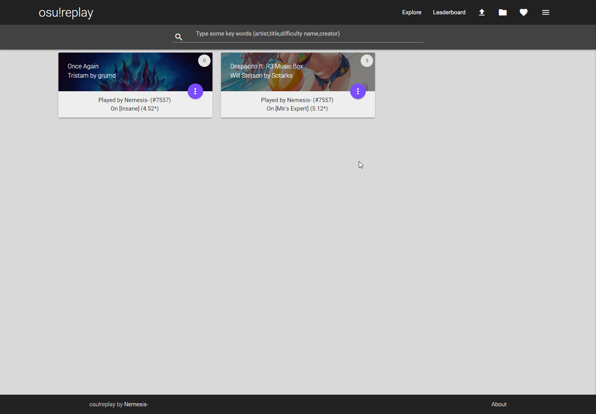

# osu!replay

__The cloud for replays__

You can share your replays or just save them privately.

## THIS IS AN EDUCATIONAL PROJECT
This is an old project to learn API and PHP. This project is not maintained anymore.

## Preview

## Features

- [X] Sign up / Log in
- [X] Upload a replay (Need a rewriting)
- [X] Public or Private
- [X] Manage your replays (View,Edit,Delete)
- [X] Add a Youtube link (Edit)
- [X] Download counter
- [X] Leaderboard
- [X] Favorites
- [X] Search bar

## Future features

- [ ] AJAX Favorites
- [ ] Add Pagination
- [ ] Refactor code

## Problems encountered

I can't fetch replay data (Like the name, mods etc..) So i add an input "beatmap_id" to fetch these data.
I can't use the `api/get_scores` because i can't fetch the data of an unranked beatmap.
